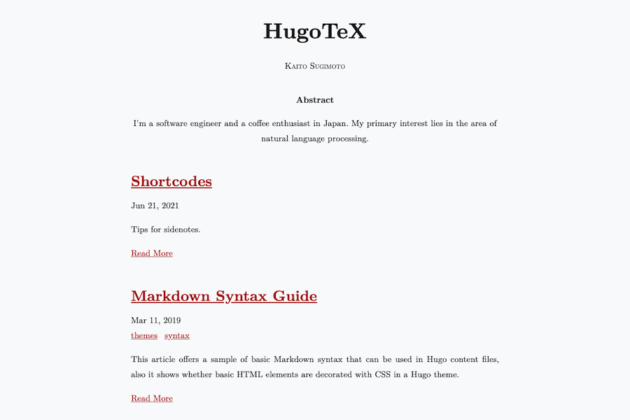

# HugoTeX

A hugo theme which looks like a LaTeX document.



**Live Demo: https://hugotex.netlify.app/**

This theme is heavily inspired by [latex-css](https://latex.now.sh/).

## Quick Start

```bash
git clone https://github.com/HelloRusk/HugoTeX
cd HugoTeX/exampleSite
hugo server -t ../..
# open http://localhost:1313/
```

Hugo (>= **0.77.0**) is required.

## Config settings

example

```toml
baseURL = "https://hugotex.netlify.app/"
title = "HugoTeX"
paginate = 3
languageCode = "en"
DefaultContentLanguage = "en"
enableInlineShortcodes = true
footnoteReturnLinkContents = "^"

[author]
  name = "Kaito Sugimoto"
  abstract = "I'm a software engineer and a coffee enthusiast in Japan. My primary interest lies in the area of natural language processing."

[taxonomies]
category = "categories"
tag = "tags"
series = "series"
```

## For contributors

Any issues or pull requests are welcome.

## LICENSE

MIT

## Similar Projects

- [queensferryme / hugo-theme-texify](https://github.com/queensferryme/hugo-theme-texify/)
